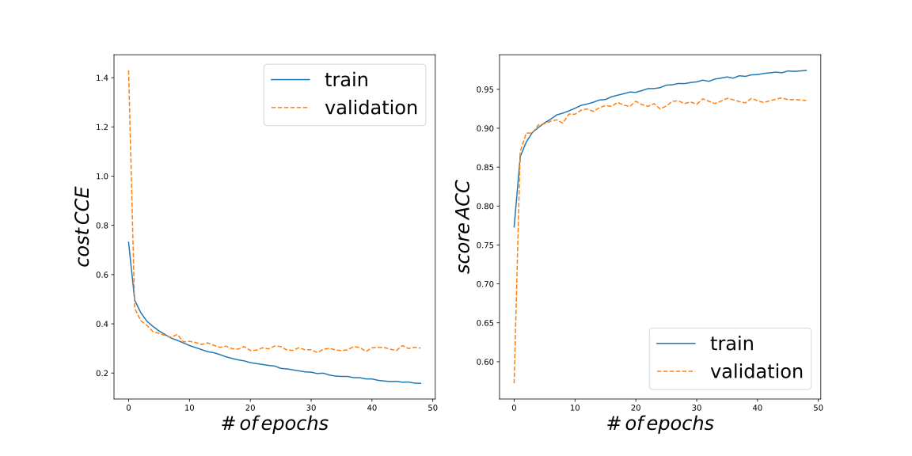

# Bayes & Batch 
### Increasing batch size during training process with the use of bayesian optimization.
This repo based on academic project on Deep Learning course. The dataset which is used is FashionMNIST. The academic project created by 2 students where one is me. The project based on Keras of TesnorFlow 2.0.
#### Requirements
- [scikit-image](https://github.com/scikit-image/scikit-image)
- [tensorflow](https://github.com/tensorflow/tensorflow)
- [bayesian-optimization](https://github.com/fmfn/BayesianOptimization)
- [pandas_ml](https://github.com/pandas-ml/pandas-ml)
- [scikit-learn-ZCA](https://github.com/mwv/zca)

## Notebook Pipeline
1. Model:
   * Stacked CNNs with PReLU activation, with maximum 3 (highparameter) Stack of CNNs. Every Stack contains:
      1. Convolutional Neural Network (CNN) with 3x3 kernel.
      2. Batch Normalization 
      4. PrrLU activation   
      3. Max Pooling with 2x2 kernel
      4. Dropout.
   * Two Full Connected layers with PreLU activation and Dropout.
2. Learning:
   * Highparameters of Bayesian Optimization:
      * l2 regularization lambda parameter
      * dropout probability
      * number of stacked CNNs.
   * The batch size increasing when after a number of epochs the val accuracy drops (this is known as patience). 
     Using an upper limit of batch size at 1000. 
        
     
3. Results: 
   * Best Highparameters dictionary:
      ```json
      {
        "dropout1": 0.16014891373510734,
        "dropout2": 0.29682615757193975,
        "dropout3": 0.3313424178159243,
        "dropout4": 0.3192322615669314, 
        "dropout5": 0.23763891522960384,
        "l2_1": 0.00017892133270076948, 
        "l2_2": 1.7008842273955582e-05, 
        "l2_3": 7.810956646576473e-06,
        "l2_4": 3.396608391291378e-05,
        "layers_123_dist": 0.8781425034294131
     }
      ```
   * Cost-Score Curves:
      
   * Test score (Accuracy): 0.9416
